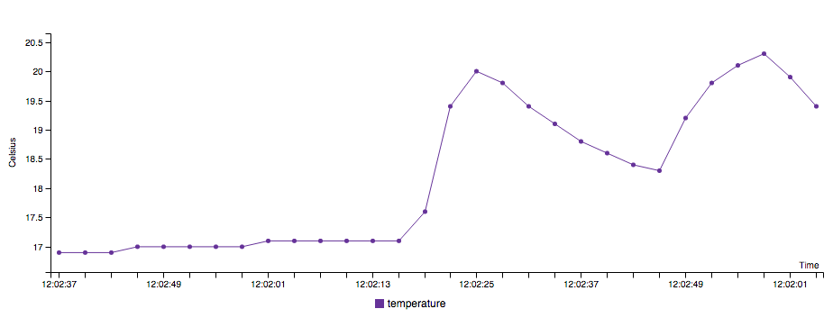

# EON Demo from sensor data using Arduino and Johnny-Five on Node.js with Express and Jade

## Quick Start
You need to install *Johnny-Five*, *PubNub*, *Jade* and *Express* to run the node.js code with Arduino.

Install all the dependencies: 

```bash
$ npm install
```

Start the server:
```bash
$ npm start
```
Then go to `http://localhost:3000` on browser

## Hardware Wiring
### Temperature
The temperature data comes from a [LM35](http://www.ti.com/product/lm35) sensor, and it is published to PubNub.

When you are using Arduino with Johnny-Five, you need to install **StandardFirmataPlus** to your Arduino to be able to run the code.

### Installing StandardFirmataPlus

1. Connect your Arduino to computer with a USB cable.
2. On [Arduino IDE](https://www.arduino.cc/en/Main/Software).
3. Go to **File** > **Examples** > **Firmata** > **StandardFirmataPlus**
4. Upload the code to the device.

Now, you are done with Arduino IDE. You can close it and switch to your fave IDE (or keep using Arduino IDE if you like).

### Arduino wiring


## Example


## Docs and Websites
* [Website of Johnny-Five](http://johnny-five.io/) - [Docs](https://github.com/rwaldron/johnny-five/wiki)
* [Website of Express](http://expressjs.com/) - [Docs - v4.x](http://expressjs.com/en/4x/api.html)
* [Website of PubNub](https://www.pubnub.com/) - [Docs](https://www.pubnub.com/documentation/)
* [Website of Jade](http://jade-lang.com/) - [Docs](http://jade-lang.com/reference/)

## Credits
An original project of [Tomomi ❤ Imura](https://github.com/girliemac)